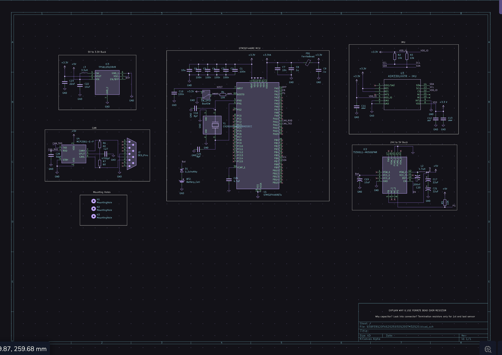
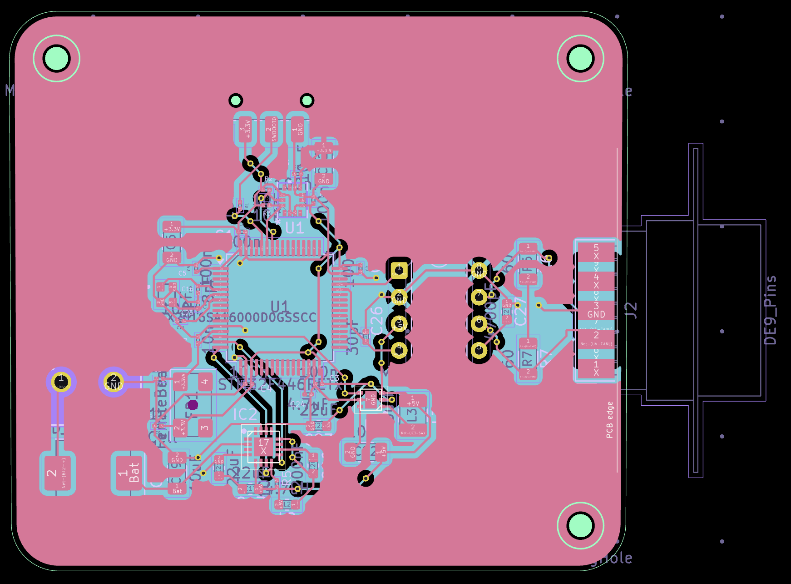

# CANBUS-Sensor-Boards
Schematic + Layout for CANBUS Protocol, IMU, Wheel Speed, and Suspension following FSAE regulation
# Overview
Prototype node boards for CAN Bus communication featuring an IMU, Wheel Speed sensors, and Suspension sensors. 
# Features
* STM32 (MCU)
* CAN Transceiver MCP2551
* Multiple Buck Converters per board (24v to 5v) and (5v to 3.3v)
# Technical Specifications
* 2 Layer Boards
* 24v Max Input

# Schematic and Layout Examples

Schematic for IMU + STM32

Layout for IMU + STM32

#
The other 2 Schematics and Layouts (wheel speed sensor and suspension sensors) can be found in the exports folder within the repo.

Designed in KiCad by Alexander Stankus

GitHub: @alexanderstankus

Email: alexstankus99@gmail.com
